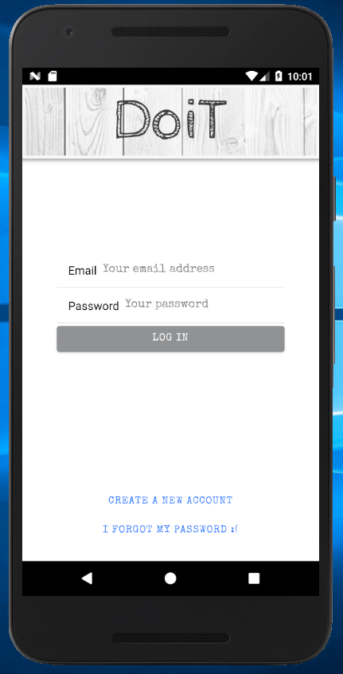
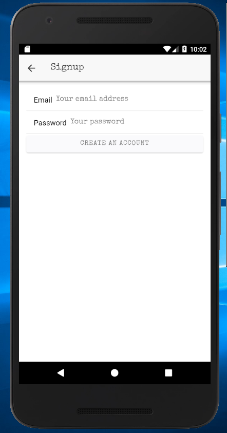
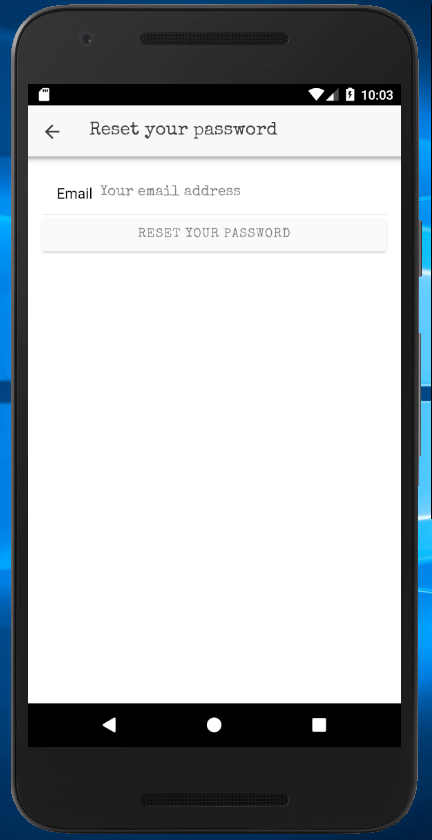
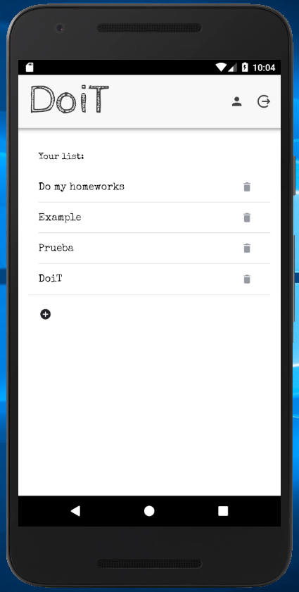
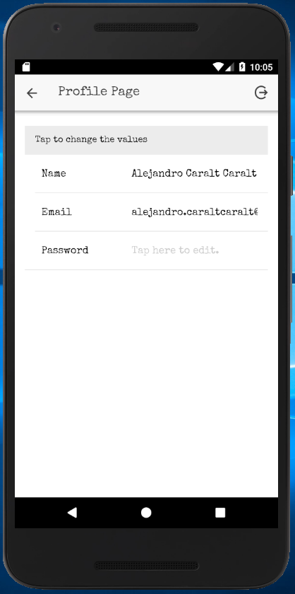
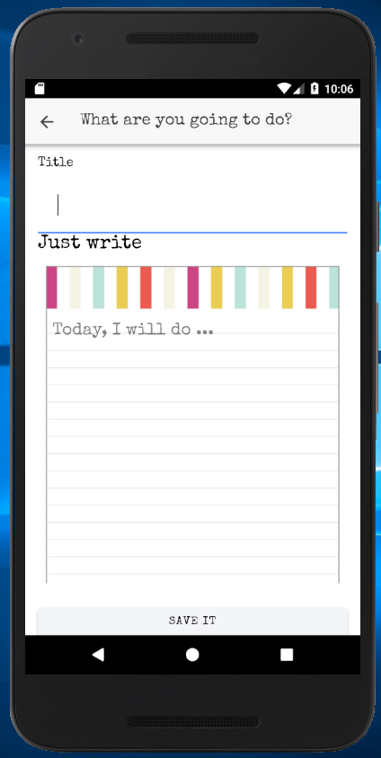
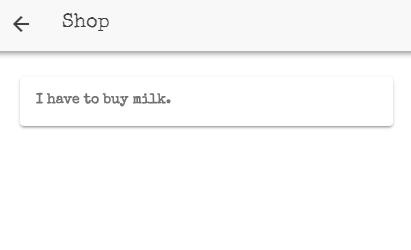
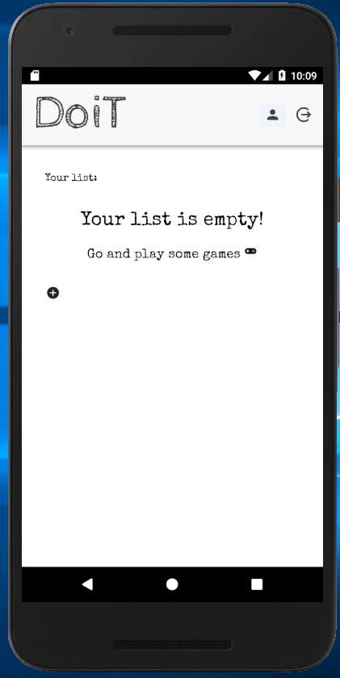

# DoIt
A way to organize your life.
An application than will help you in your daily dutys, to keep you organized and do the things you never ended.

I builded this entire application based on the firbaseAuth-Ionic guide made by [Javebratt](https://javebratt.com)

## App views:
- Login
- Signup
- Reset password
- Home
- Profile
- Create new note
- Note details

## Login
#### The login view is simple, the DoiT title, two inputs to log in and two buttons to reset your password or create a new account.

## Signup
#### The easiest way to signup, two inputs validating the data, minimun range of six characters for the password and  be redirected to the home page when you finish.

## Reset your Password
#### In the case you have forgeted your password and you cant log in becouse of that, you can easly put your email and we will send you a reset password link.

## Home Page
#### And finally it's time for the main page, where all your troubles comes in a great looking way, you'll be able to organize your self by simplealy adding and removing notes from your list. Check out the things you have to do and Just DoiT.

## Profile
#### Sometimes we identify our self by a nickname, right? So you can change yours in the app profile by clicking the human been icon in the homepage, you'll be redirected to the profile page, where you can change your nickname, email and even the password.

## Create new Note
#### So lets back to the main thing, you have to write your daily dutys to let the app work, if not, all this is useless. Creating is simple, you just need a title to identify quickly the main thing and the description of that work. By clicking the plus symbol in the home page you'll be right there to create a new note. What are you wating for, you have a lot to do.

## Note Details
#### Remember, by clicking in the title of your duty list you'll be able to see the description of the note.

## The END
#### And the last thing, you have done everything until this, and now you have nothing to do... That's a lie, becouse you always have something to do, improving the things you are not good at, tasting the food you haven't tasted ever, traveling to places you would not imagine that they were over there. There is a lot of things to do in this life my friend, so don't forget to put them on your list :+1:.  

###### [Here](https://drive.google.com/file/d/14xzutRP_vB5L3al8QNFhXn03X_-NVzE_/view?usp=sharing) you can dowload the app and use it for free.
